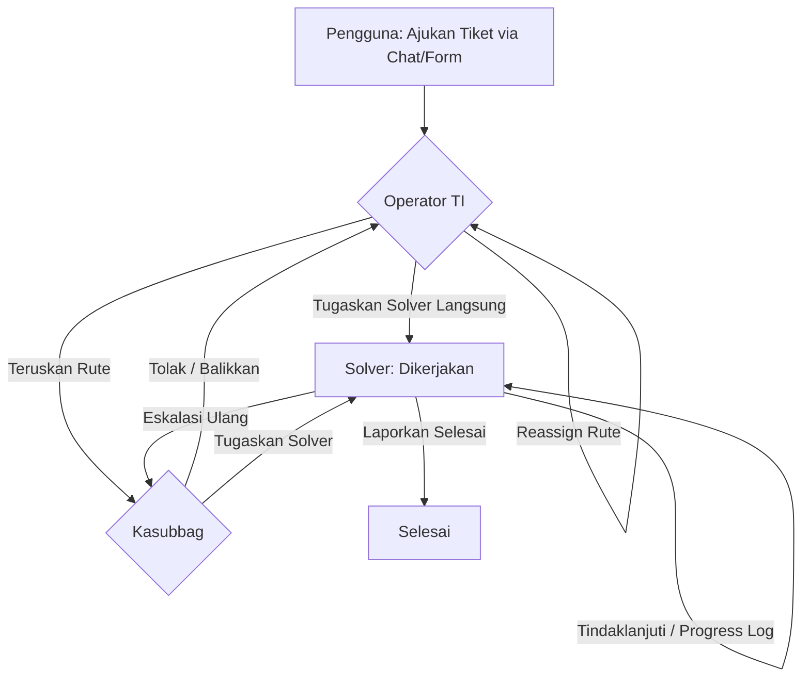

# 🌸 Melati V2 — Portal Layanan TI Biro TIK BPK RI

[](https://laravel.com)
[](https://vite.dev)
[](https://tailwindcss.com)
[](https://alpinejs.dev)

**Melati V2** adalah portal terintegrasi layanan bantuan Teknologi Informasi (IT Helpdesk & Service Desk) yang dirancang khusus untuk lingkungan internal **Badan Pemeriksa Keuangan Republik Indonesia (BPK RI)**. Aplikasi ini mempermudah pelaporan insiden, permintaan layanan, pengelolaan antrean tiket bantuan, hingga penugasan kerja solver TI secara cerdas dan efisien.

---

## 🚀 Fitur Utama & Keunggulan

### 🤖 1. Asisten Virtual Layanan TI (Gemini AI Chatbot)
* **Diagnosis Cerdas:** Pengguna dapat menceritakan kendala dengan bahasa sehari-hari. AI akan menganalisis masalah secara langsung dan menyarankan solusi troubleshooting mandiri.
* **Unggah & Tempel (Paste) Screenshot:** Pengguna dapat menempelkan screenshot (`Ctrl + V`) atau mengunggah gambar/foto kendala. AI akan secara otomatis menganalisis tampilan error atau masalah visual untuk memberikan arahan yang tepat.
* **Deteksi GIF Otomatis:** Mengamankan pengiriman dengan membatasi format `.gif` baik di frontend maupun backend.
* **Auto-Routing Tiket:** Jika kendala belum teratasi setelah dipandu AI, sistem secara cerdas akan merekomendasikan kategori layanan Level 1, 2, dan 3 yang sesuai dari katalog layanan BPK RI dan mengisi form tiket secara otomatis.

### 👥 2. Workflow Kolaboratif Berbasis Peran (Roles)
* **Pelapor (Pengguna):** Mengajukan tiket baru, berdiskusi melalui obrolan langsung, dan melacak kemajuan pengerjaan tiket.
* **Operator Biro TI:** Memiliki visibilitas penuh atas seluruh tiket masuk, dapat memindahkan rute subbagian (*Reassign*), atau langsung menugaskan tiket ke solver tertentu.
* **Kasubbag (Dispatcher):** Memverifikasi tiket masuk, mendistribusikan penugasan solver, mengembalikan tiket tidak layak ke operator, dan mengonfirmasi penyelesaian tiket.
* **Solver (Petugas Lapangan):** Mengambil tiket secara mandiri (*Claim*), menulis progress log penanganan (*Tindaklanjuti*), eskalasi balik ke Kasubbag jika memerlukan arahan khusus, dan menyelesaikan tiket.

### ⚡ 3. Real-time Notification & Busy Status Limit
* **Notification Bell:** Notifikasi instan di dalam aplikasi bagi pelapor, kasubbag, dan solver ketika terjadi perubahan status atau penugasan tiket baru.
* **Busy Status Indicator:** Mencegah overload kerja solver dengan membatasi jumlah tiket aktif maksimal **6 tiket**. Status beban kerja diwakili indikator warna dinamis:
  * 🟢 **Low** (0-2 tiket aktif)
  * 🟡 **Med** (3-5 tiket aktif)
  * 🔴 **Hi / Penuh** (6 atau lebih tiket aktif — melarang solver mengambil tiket baru).

---

## 🗺️ Alur Tiket Melati V2 (Ticket Lifecycle)



---

## 🛠️ Spesifikasi Teknologi Stack

* **Framework Backend:** Laravel 12.0 (PHP 8.2+)
* **Asset Bundler:** Vite 7.0
* **CSS Framework:** Tailwind CSS 4.0
* **Frontend Logic & Reactivity:** Alpine.js 3.x
* **AI Engine:** Google Gemini API (menggunakan model `gemini-3.5-flash` dengan fallback `gemini-2.5-flash` & `gemini-2.5-flash-lite`)
* **Icons:** Lucide Icons
* **Database:** SQLite (Default / Local file database)

---

## 🔑 Akun Uji Coba (Demo Credentials)

Untuk memudahkan peninjauan alur kerja multi-role, gunakan akun seed berikut:

| Peran (Role) | Username | Password | Deskripsi / Subbagian |
|---|---|---|---|
| **Operator TI** | `admin` | `admin123` | Operator Utama Biro TI |
| **Pengguna 1** | `budi` | `budi123` | Pegawai BPK (Pelapor 1) |
| **Pengguna 2** | `siti` | `siti123` | Pegawai BPK (Pelapor 2) |
| **Kasubbag 1** | `kasubbag.infrastruktur` | `pass123` | Kasubbag Jaringan & Infrastruktur (`k1`) |
| **Kasubbag 2** | `kasubbag.pelayanan` | `pass123` | Kasubbag Pelayanan TIK (`k2`) |
| **Solver 1** | `solver.infra.1` | `solver123` | Solver Jaringan & Infrastruktur |
| **Solver 2** | `solver.tik.1` | `solver123` | Solver Pelayanan TIK |

---

## ⚙️ Petunjuk Instalasi & Menjalankan Lokal

Ikuti langkah-langkah berikut untuk setup environment lokal Anda:

### 1. Kloning Repository
```bash
git clone https://github.com/IvandraJulio/TEHMELATI.git
cd TEHMELATI
```

### 2. Jalankan Perintah Setup
Gunakan script composer `setup` yang telah dikonfigurasi untuk otomatis menginstal seluruh dependensi PHP & Node.js, men-copy `.env`, men-generate key, membuat file database SQLite, serta melakukan migrasi database:
```bash
composer run setup
```

### 3. Konfigurasi Google Gemini API Key
Untuk mengaktifkan Asisten Virtual AI, buka file `.env` yang baru digenerate dan tambahkan API Key Google Gemini Anda:
```env
GEMINI_API_KEY=your_gemini_api_key_here
```

### 4. Seed Database dengan Data Uji Coba
Jalankan seeder untuk mengisi tabel user demo dan mengimpor **50 tiket riwayat layanan**:
```bash
php artisan db:seed
```

### 5. Jalankan Development Server
Gunakan script terintegrasi untuk menjalankan Laravel Server, Queue listener, dan Vite Dev Server secara bersamaan dalam satu command:

* **Sistem Operasi Windows:**
  ```bash
  composer run dev-win
  ```
* **Sistem Operasi macOS / Linux:**
  ```bash
  composer run dev
  ```

Akses portal melalui browser Anda di alamat: **`http://127.0.0.1:8000`**

---

## 📝 Catatan Tambahan (Developer Note)
* **Queue Listener:** Beberapa notifikasi dan proses latar belakang bergantung pada Queue. Pastikan tab server development tetap aktif agar `php artisan queue:listen` terus memproses antrean job.
* **MIME Verification:** Pengunggahan gambar divalidasi ketat di level frontend dan controller backend untuk mencegah format gif atau file non-gambar masuk ke prompt multimodal AI.
